# 🏗️ TOKENLY PROTOCOL v5.0 — COMPLETE PROJECT WHITEBOARD CHART (ENHANCED)

> **The Global Liquidity Layer for Physical Assets**
> *Authentication · Liquidity · Fair Pricing — In that order. Always.*

---

## 📐 1. HIGH-LEVEL SYSTEM ARCHITECTURE

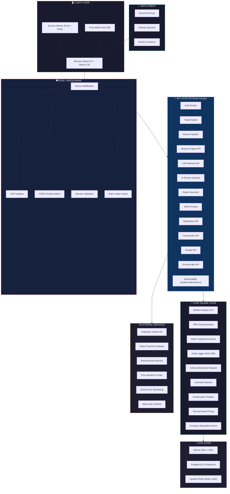

---

## 🗂️ 2. COMPLETE PROJECT FOLDER MAP

```
tokenly-final/
├── 📄 Configuration Files
│   ├── package.json              — Dependencies + scripts (Next.js 16, React 19, 54 deps)
│   ├── next.config.ts            — Security headers, external packages
│   ├── tsconfig.json             — TypeScript strict config
│   ├── tailwind.config.ts        — TailwindCSS v4 theme (gold/green palette)
│   ├── postcss.config.js         — PostCSS pipeline
│   ├── eslint.config.mjs         — ESLint config
│   ├── jest.config.js            — Jest testing config (ts-jest)
│   └── .env.example/.env.local   — Environment variable templates
│
├── 🚀 Deployment
│   ├── Dockerfile                — Multi-stage Node 20 Alpine build
│   ├── railway.toml              — Railway deploy + persistent /data mount
│   ├── vercel.json               — Vercel framework config
│   ├── .vercelignore             — Vercel ignore rules
│   └── .dockerignore             — Docker ignore rules
│
├── 📊 Documentation
│   ├── README.md                 — Protocol overview + API docs
│   ├── IMPLEMENTATION.md         — 44 delivered files breakdown
│   ├── PRODUCTION_ROADMAP.md     — 24-feature status matrix
│   └── SECURITY.md               — Security architecture notes
│
├── 🔒 CI/CD & Quality
│   ├── .github/                  — GitHub Actions workflows
│   ├── .husky/                   — Git hooks (pre-commit lint)
│   ├── scripts/                  — Migration, seed, verification scripts
│   └── coverage/                 — Jest coverage reports
│
├── 📂 src/                       — SOURCE CODE ROOT
│   ├── middleware.ts             — Security middleware (CSP, CSRF, Auth)
│   ├── instrumentation.ts        — Sentry init
│   │
│   ├── 📂 app/                   — Next.js App Router (25+ pages)
│   │   ├── layout.tsx            — Root layout (Privy, Navbar, Footer, AI)
│   │   ├── page.tsx              — Landing page (hero, features, stats)
│   │   ├── globals.css           — Design system (30KB+ of tokens)
│   │   ├── error.tsx             — Error boundary page
│   │   ├── loading.tsx           — Loading skeleton
│   │   ├── not-found.tsx         — 404 page
│   │   │
│   │   ├── 📂 api/               — 35 API Route Groups (see Section 5)
│   │   ├── 📂 dashboard/         — User dashboard
│   │   ├── 📂 market/            — Trading marketplace
│   │   ├── 📂 portfolio/         — Portfolio management
│   │   ├── 📂 vault/             — Asset vault
│   │   ├── 📂 explorer/          — Public proof-of-trust ledger
│   │   ├── 📂 leaderboard/       — RRS leaderboard
│   │   ├── 📂 review/            — Review submission
│   │   ├── 📂 products/          — Product details
│   │   ├── 📂 can/               — CAN authenticator portal
│   │   ├── 📂 archionlabs/       — ArchionLabs AI studio
│   │   ├── 📂 construction/      — Construction marketplace
│   │   ├── 📂 resale/            — Second-hand resale + VR lobby
│   │   ├── 📂 deposit/           — Stripe deposit (real Elements)
│   │   ├── 📂 analytics/         — Analytics dashboard
│   │   ├── 📂 compliance-stack/  — Compliance audit chain
│   │   ├── 📂 admin/             — Admin panel
│   │   ├── 📂 investordata/      — Investor data dashboard
│   │   ├── 📂 about/             — About page
│   │   ├── 📂 terms/             — Terms of service
│   │   ├── 📂 verify/            — Verification
│   │   ├── 📂 viewer/            — Secure viewer
│   │   ├── 📂 forgot-password/   — Password recovery
│   │   └── 📂 reset-password/    — Password reset
│   │
│   ├── 📂 components/            — 40+ React Components
│   │   ├── Navbar.tsx             — Main navigation
│   │   ├── Footer.tsx             — Site footer
│   │   ├── AIAssistant.tsx        — Floating AI chat
│   │   ├── TokenRain.tsx          — 3D token animation
│   │   ├── ThreeTokens.tsx        — Three.js 3D tokens
│   │   ├── CustomCursor.tsx       — Custom cursor effect
│   │   ├── NoiseOverlay.tsx       — Grain texture overlay
│   │   ├── NotificationBell.tsx   — In-app notification bell
│   │   ├── PushNotificationBell.tsx — Web Push bell
│   │   ├── GlobalTicker.tsx       — Bottom ticker marquee
│   │   ├── TradeFeed.tsx          — Live trade feed
│   │   ├── Toast.tsx              — Toast notification system
│   │   ├── ErrorBoundary.tsx      — React error boundary
│   │   ├── PageSkeleton.tsx       — Loading skeletons
│   │   ├── 📂 archionlabs/       — BuildPanel, Building3D, SimulationPanel, ViewerPanel
│   │   ├── 📂 dashboard/         — DashboardStats, PortfolioTable, QuickActions
│   │   ├── 📂 vault/             — AlertModal, BinanceChart, OrderBook, WisdomPriceCard
│   │   ├── 📂 can/               — CANTierCard
│   │   ├── 📂 providers/         — PrivyProvider, AuthHydrator
│   │   ├── 📂 shared/            — AppProvider, ErrorBanner, LoadingSpinner, StatCard
│   │   └── 📂 ui/                — Badge, Button, Card, Input
│   │
│   ├── 📂 lib/                   — 37 Core Library Modules
│   │   ├── db.ts                 — Database engine (SQLite/PG + 10 migrations)
│   │   ├── wisdom-engine.ts      — Weighted price consensus (4 signals)
│   │   ├── rrs.ts                — Reviewer Reputation Score engine
│   │   ├── wash-trading.ts       — 5-rule wash trading prevention
│   │   ├── audit.ts              — Immutable audit log (SHA-256)
│   │   ├── can.ts                — CAN Authenticator Network tiers
│   │   ├── email.ts              — Resend email (5 luxury templates)
│   │   ├── push.ts               — Web Push via VAPID
│   │   ├── store.ts              — Zustand global state
│   │   ├── types.ts              — 490 lines of TypeScript interfaces
│   │   ├── session.ts            — httpOnly cookie sessions
│   │   ├── env.ts                — Startup env validation
│   │   ├── rate-limit-request.ts — Per-route Upstash rate limits
│   │   ├── anomaly-detector.ts   — Z-score anomaly detection
│   │   ├── construction-timeline.ts — Timeline with buffers
│   │   ├── second-hand-pricing.ts  — Resale price model
│   │   ├── groq.ts + groq-resilience.ts — AI with circuit breaker
│   │   ├── sanitize.ts           — Input sanitization
│   │   ├── cache.ts              — In-memory cache
│   │   ├── metrics.ts            — Prometheus metrics
│   │   ├── logger.ts             — Pino structured logging
│   │   ├── 📂 services/          — ai-vision-service, wisdom-service
│   │   └── 📂 validation/        — Zod schemas
│   │
│   └── 📂 __tests__/             — 12 Test Suites (130+ test cases)
│
├── 📂 public/                    — Static assets + PWA
│   ├── manifest.json             — PWA manifest
│   ├── sw.js                     — Service worker
│   ├── icon-192/512.png          — PWA icons
│   └── badge-72.png              — Android notification badge
│
├── 📂 migrations/                — SQL migration files
└── 📂 FINAL_MASTER/              — Master reference docs
```

---

## 🔄 3. CORE USER JOURNEYS (HOW THE SYSTEM IS USED)

### Journey 1: The Tokenization Pipeline (Seller)

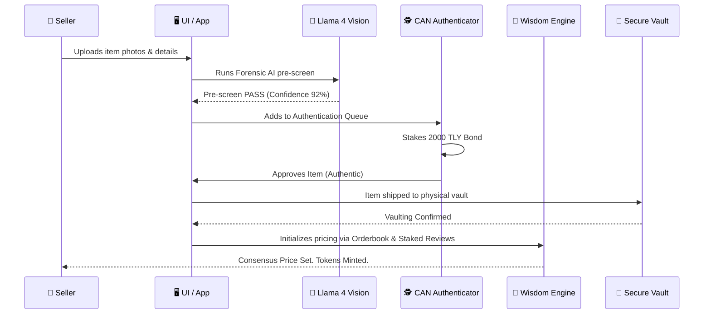

### Journey 2: Fractional Trading (Buyer)

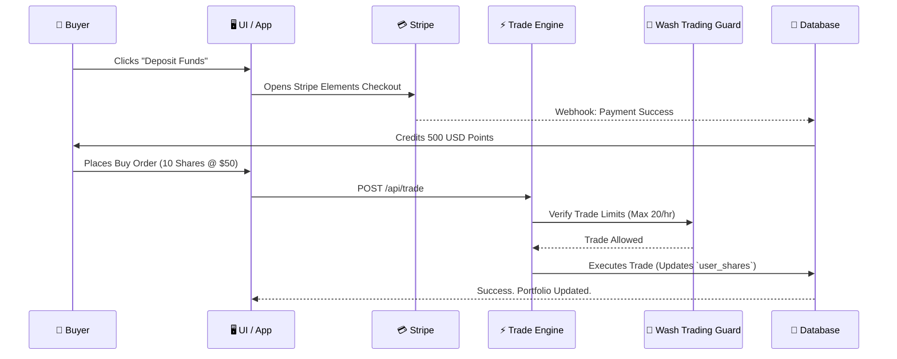

### Journey 3: CAN Authentication (Auditor)

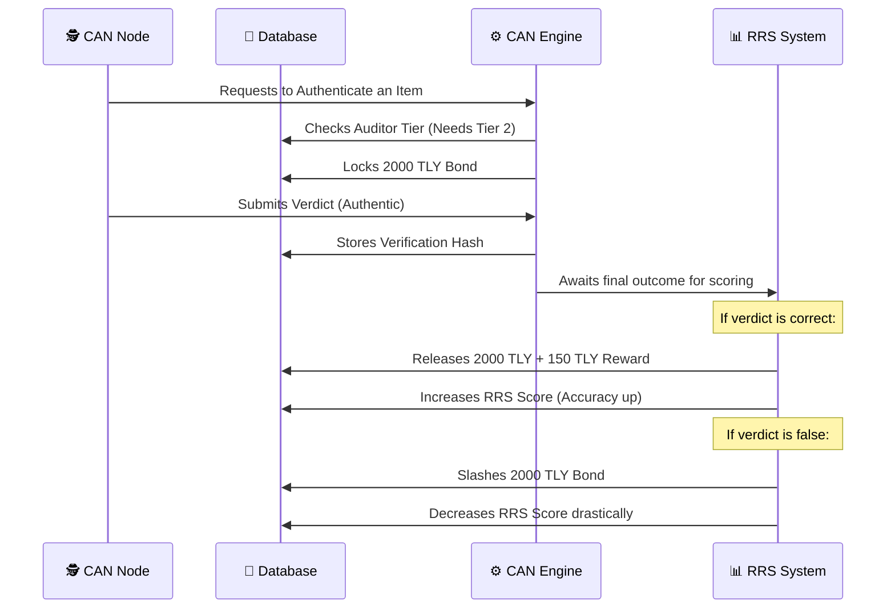

---

## 🎨 4. FRONTEND ARCHITECTURE

```mermaid
graph TB
    subgraph LAYOUT["Root Layout"]
        PRIVY_P["PrivyAuthProvider"]
        AUTH_H["AuthHydrator (hydrates from /api/auth/me)"]
        NAVBAR["Navbar"]
        AI_CHAT["AI Assistant (Floating)"]
        TOAST["Toast System"]
        FOOTER["Footer"]
        ERROR_B["ErrorBoundary"]
    end

    subgraph PAGES["25+ Pages"]
        LANDING["/ Landing (Hero + Features)"]
        DASH["Dashboard (Stats + Portfolio + Quick Actions)"]
        MARKET["Market (Trading Interface)"]
        VAULT["Vault (OrderBook + Charts + Alerts)"]
        PORTFOLIO["Portfolio (Holdings + Sparklines)"]
        EXPLORER["Explorer (Public Ledger)"]
        LEADER["Leaderboard (RRS Rankings)"]
        REVIEW["Review (Submit Estimates)"]
        PRODUCTS["Products (Detail Views)"]
        CAN_PAGE["CAN Portal (Bond + Verify)"]
        ARCHION["ArchionLabs Studio"]
        CONSTRUCT["Construction Marketplace"]
        RESALE_P["Resale (Estimate + List)"]
        LOBBY["VR Lobby (WebGL/WebXR)"]
        DEPOSIT["Deposit (Stripe Elements)"]
        ANALYTICS["Analytics Dashboard"]
        COMPLIANCE["Compliance Stack"]
        ADMIN_P["Admin Panel"]
        INVESTOR["Investor Data"]
        FORGOT["Forgot Password"]
        RESET["Reset Password"]
    end

    subgraph STATE["State Management"]
        ZUSTAND["Zustand Store"]
        USER_STATE["user: User | null"]
        HYDRATED["hydrated: boolean"]
        TOASTS_STATE["toasts: ToastItem[]"]
    end

    subgraph DESIGN["Design System"]
        FONTS["Google Fonts: Outfit + Inter + JetBrains Mono"]
        PALETTE["Palette: Rolex Gold (#a37e2c), Green (#006039), Dark (#050505)"]
        MOTION["Framer Motion Animations"]
        THREEJS["Three.js 3D Rendering"]
        RECHARTS["Recharts Data Visualization"]
        LWCHARTS["Lightweight Charts (Trading)"]
        LUCIDE["Lucide React Icons"]
        CSS_VARS["CSS Custom Properties (30KB design tokens)"]
    end

    LAYOUT --> PAGES
    PAGES --> STATE
    PAGES --> DESIGN

    style LAYOUT fill:#1a1a2e,stroke:#a37e2c,color:#fff
    style PAGES fill:#0f3460,stroke:#3b82f6,color:#fff
    style STATE fill:#1e1e30,stroke:#22c55e,color:#fff
    style DESIGN fill:#1e1e30,stroke:#8b5cf6,color:#fff
```

### Complete Technology Stack

| Layer | Technology | Version | Purpose |
|---|---|---|---|
| **Framework** | Next.js (App Router) | 16.2.6 | SSR + Routing + API Routes |
| **UI Library** | React | 19.2.4 | Component rendering |
| **Styling** | TailwindCSS + CSS Variables | 4.2.4 | Utility-first + Design tokens |
| **State** | Zustand | 5.0.12 | Global state (auth, toasts) |
| **Animation** | Framer Motion | 12.38.0 | Page transitions + micro-animations |
| **3D Engine** | Three.js + Web-IFC | 0.184.0 | Token rain, VR lobby, BIM Viewer |
| **Charts** | Recharts + Lightweight Charts | 2.15 / 5.2 | Analytics + Trading charts |
| **Icons** | Lucide React | 1.8.0 | UI icons |
| **Auth UI** | Privy React Auth | latest | Wallet/social login modal |
| **Database** | better-sqlite3 / pg | 12.9 / 8.20 | Data persistence |
| **Cache/Queue**| BullMQ + ioredis | 5.34 | Background jobs & queues |
| **Validation** | Zod | 3.24 | Schema validation |

---

## ⚙️ 5. BACKEND ARCHITECTURE & APIs

### API Route Map (35 Groups)

```mermaid
graph LR
    subgraph PUBLIC["🌐 Public (No Auth)"]
        A1["/api/auth — Login/Signup"]
        A2["/api/auth/sync — Privy sync"]
        A3["/api/ticker — Platform stats"]
        A4["/api/products — Product catalog"]
        A5["/api/health — Health check"]
        A6["/api/ready — Readiness probe"]
        A7["/api/metrics — Prometheus"]
        A8["/api/csrf — CSRF token"]
        A9["/api/resale/estimate — Price estimate"]
        A10["/api/archionlabs/compliance"]
        A11["/api/archionlabs/simulation"]
    end

    subgraph PROTECTED["🔒 Authenticated"]
        B1["/api/trade — Execute trades"]
        B2["/api/reviews — Submit reviews"]
        B3["/api/wisdom — Price signals"]
        B4["/api/ai — Claude advisor"]
        B5["/api/ai-predict — Price prediction"]
        B6["/api/ai-vision — Vision verification"]
        B7["/api/can/bond — Bond pledge"]
        B8["/api/can/verify — Asset verification"]
        B9["/api/portfolio/gift — Share gifting"]
        B10["/api/quests — Quest system"]
        B11["/api/quests/claim — Claim rewards"]
        B12["/api/alerts — Price alerts"]
        B13["/api/certificate — PDF certificate"]
        B14["/api/redeem — Physical redemption"]
        B15["/api/deposit — Deposit funds"]
        B16["/api/notifications/subscribe"]
        B17["/api/notifications/unsubscribe"]
        B18["/api/feed — Trade feed"]
        B19["/api/search — Search"]
        B20["/api/export — Data export"]
        B21["/api/dashboard — Dashboard data"]
        B22["/api/leaderboard — Rankings"]
        B23["/api/explorer — Explorer data"]
        B24["/api/analytics — Analytics data"]
    end

    subgraph PAYMENTS["💳 Payments"]
        C1["/api/stripe/payment-intent"]
        C2["/api/stripe/verify"]
        C3["/api/stripe/webhook"]
    end

    subgraph MARKETPLACE["🏗️ Marketplace (GET Public)"]
        D1["/api/construction/projects"]
        D2["/api/construction/companies"]
        D3["/api/construction/bids"]
        D4["/api/construction/milestones"]
        D5["/api/resale/listings"]
    end

    subgraph ADMIN["👑 Admin Only"]
        E1["/api/admin/audit"]
        E2["/api/admin/redemptions"]
        E3["/api/admin/seed"]
        E4["/api/admin/construction/approve"]
        E5["/api/investor — Investor data"]
    end

    style PUBLIC fill:#064e3b,stroke:#22c55e,color:#fff
    style PROTECTED fill:#1e3a5f,stroke:#3b82f6,color:#fff
    style PAYMENTS fill:#78350f,stroke:#f59e0b,color:#fff
    style MARKETPLACE fill:#312e81,stroke:#8b5cf6,color:#fff
    style ADMIN fill:#7f1d1d,stroke:#ef4444,color:#fff
```

### Core Engine Modules Breakdown

| Module | File | Algorithm / Purpose |
|---|---|---|
| **Wisdom Engine** | `wisdom-engine.ts` | `Price = 60% trades + 25% external + 10% reviews + 5% recency` with exponential decay |
| **RRS Engine** | `rrs.ts` | `RRS = Accuracy(45%) + Volume(25%) + Consistency(20%) + Longevity(10%)` → 5 tiers |
| **Wash Trading** | `wash-trading.ts` | 5 rules: 10min cooldown, 15% price cap, 20 trades/hr, self-trade block, volume spike |
| **Audit Logger** | `audit.ts` | Immutable SHA-256 hash chain — MAS compliance ready |
| **CAN Network** | `can.ts` | 3-tier bond system: 500/2000/5000 TLY |
| **Anomaly Detector** | `anomaly-detector.ts` | Z-score detection + 40% shift threshold |
| **Construction Timeline** | `construction-timeline.ts` | Phase-based timeline with seasonal buffers, area scaling |
| **Second-Hand Pricing** | `second-hand-pricing.ts` | Condition + usability + location-aware pricing model |
| **CRS** | `crs.ts` | Company Reputation Score for construction firms |

---

## 🤖 6. AI & MACHINE LEARNING PIPELINE

Tokenly integrates advanced AI capabilities across multiple verticals, utilizing an intelligent resilient circuit breaker to prevent cascade failures.

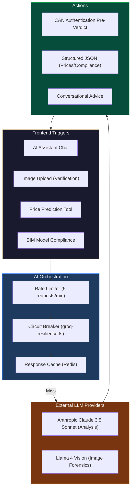

### AI Features Table

| Feature | Model Engine | Purpose | Location |
|---|---|---|---|
| **Chat Advisor** | Claude 3.5 Sonnet | Context-aware trading assistant, system guide | `<AIAssistant />` |
| **Vision Verification** | Llama 4 Vision | Analyzes hardware, stitching, and serial numbers to pre-screen items | `ai-vision-service.ts` |
| **Price Prediction** | Claude 3.5 Sonnet | Combines internal DB metrics with historical market data to forecast trends | `/api/ai-predict` |
| **BIM Compliance** | Claude 3.5 Sonnet | Scans IFC/GLB data against building codes (ArchionLabs) | `/api/archionlabs/compliance` |

---

## 💾 7. DATABASE ARCHITECTURE

```mermaid
erDiagram
    users ||--o{ reviews : "writes"
    users ||--o{ trades : "executes"
    users ||--o{ user_shares : "holds"
    users ||--o{ orders : "places"
    users ||--o{ notifications : "receives"
    users ||--o{ alerts : "sets"
    users ||--o{ quest_completions : "completes"
    users ||--o{ authentications : "certifies"
    users ||--o{ seller_bonds : "locks"
    users ||--o{ redemptions : "claims"
    users ||--o{ push_subscriptions : "subscribes"
    users ||--o{ password_reset_tokens : "requests"
    users ||--o{ stripe_payments : "pays"
    users ||--o{ construction_companies : "owns"
    users ||--o{ construction_projects : "creates"
    users ||--o{ proposals : "proposes"
    users ||--o{ proposal_votes : "votes"
    users ||--o{ second_hand_listings : "lists"

    products ||--o{ reviews : "reviewed"
    products ||--o{ trades : "traded"
    products ||--o{ user_shares : "fractionalized"
    products ||--o{ orders : "ordered"
    products ||--o{ price_history : "tracked"
    products ||--o{ alerts : "monitored"
    products ||--o{ authentications : "verified"

    construction_projects ||--o{ construction_bids : "receives"
    construction_projects ||--o{ construction_milestones : "contains"
    construction_companies ||--o{ construction_bids : "submits"
    proposals ||--o{ proposal_votes : "collected"
```

### All 28 Database Tables

| # | Table | Key Fields | Purpose |
|---|---|---|---|
| 1 | `users` | email, points, rrs_score, privy_did | User profiles, auth, Web3 identity |
| 2 | `products` | consensus_price, verification_status | Physical vaulted assets |
| 3 | `reviews` | price_estimate, points_staked | Staked price estimates |
| 4 | `user_shares` | user_id, product_id, shares | Fractional ownership ledger |
| 5 | `trades` | trade_type, shares, price_per_share | Executed trades |
| 6 | `point_transactions`| amount, type, description | Point credit/debit ledger |
| 7 | `platform_metrics`| fees_collected, insurance_pool | Protocol-wide financials |
| 8 | `rate_limits` | key, count, window_start | API rate tracking |
| 9 | `experiment_events` | event_type, event_data | A/B test event logs |
| 10 | `price_history` | product_id, price, shares | Trade tick history for charts |
| 11 | `orders` | trade_type, status, points_locked | Open limit orders |
| 12 | `seller_bonds` | bond_amount, status | Security collateral (locked/released) |
| 13 | `redemptions` | status, tracking_number, carrier | Physical delivery claims |
| 14 | `quest_completions` | user_id, quest_id | Tutorial task logs |
| 15 | `authentications` | verdict, confidence_score | CAN verification verdicts |
| 16 | `alerts` | target_price, direction | Price alert triggers |
| 17 | `audit_log` | action, integrity_hash (SHA-256) | Tamper-proof change ledger |
| 18 | `notifications` | title, message, type, is_read | In-app notification queue |
| 19 | `proposals` | status, votes_for, votes_against | DAO governance proposals |
| 20 | `proposal_votes` | vote_type, weight | DAO votes |
| 21 | `construction_companies` | crs_score, specializations | Construction firm directory |
| 22 | `construction_projects`| status, legal_status, token_minted | Real estate projects |
| 23 | `construction_bids` | fixed_price, milestone_schedule | Contractor bids |
| 24 | `construction_milestones` | status, evidence_json, verified_by | Build progress tracking |
| 25 | `second_hand_listings` | condition_grade, base_price | Resale listings |
| 26 | `password_reset_tokens`| token_hash, expires_at, used_at | Secure reset tokens |
| 27 | `stripe_payments` | payment_intent_id, amount_usd | Payment idempotency |
| 28 | `push_subscriptions` | endpoint, p256dh_key, auth_key | Web Push device registries |

---

## 🛡️ 8. SECURITY & ERROR HANDLING ARCHITECTURE

### Security Perimeter

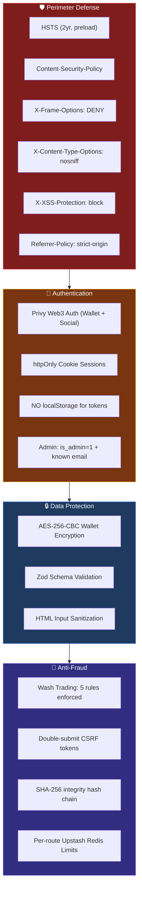

### Observability & Error Flow

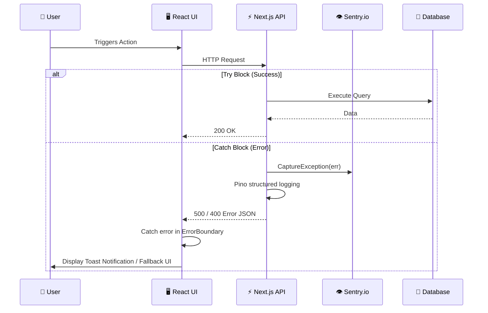

---

## 📬 9. NOTIFICATION SYSTEM

| Event | In-App | Push | Email |
|---|:---:|:---:|:---:|
| Signup | ✅ | ✅ | ✅ Welcome |
| Trade executed | ✅ | ✅ | ✅ Confirmation |
| Review submitted | ✅ | ✅ | — |
| Price alert triggered | ✅ | ✅ | ✅ Alert |
| CAN bond pledged | ✅ | ✅ | — |
| CAN verdict | ✅ | ✅ | — |
| Construction milestone | ✅ | ✅ | ✅ Admins |
| Redemption initiated | ✅ | ✅ | ✅ User + Admin |
| Asset dispatched | ✅ | ✅ | ✅ Tracking |
| Deposit cleared | ✅ | ✅ | ✅ Receipt |
| Password reset | — | — | ✅ Link |

---

## 🧪 10. TESTING COVERAGE

| Test Suite | File | Coverage Areas | Tests |
|---|---|---|---|
| **Trade Engine** | `trade.test.ts` | Fee rates, AMM formula, order totals, seller bonds, input validation | 15+ |
| **RRS Core & Integration**| `rrs.test.ts`, `rrs-integration.test.ts` | Accuracy bands, isAccurate, score calculation, edge cases | 24+ |
| **Wash Trading** | `wash-trading.test.ts` | All 5 wash-trading rules independently | 15+ |
| **Anomaly Detection** | `anomaly-detector.test.ts` | Z-score, 40% shift, edge cases | 8+ |
| **Auth Validation** | `auth-validation.test.ts` | Tokens, email/password rules, SHA-256 hashing, expiry | 12+ |
| **Audit Logger** | `audit.test.ts` | Hash chain integrity, action logging | 10+ |
| **Wisdom Engine** | `wisdom-engine.test.ts` | Signal computation, recency decay, confidence | 12+ |
| **Construction Timeline** | `construction-timeline.test.ts` | Seasonal buffers, area scaling, complexity, UDA queue | 10+ |
| **Notification Pipeline** | `notification-pipeline.test.ts` | DB insert, push hook, concurrency | 10+ |
| **AI Vision** | `ai-vision-service.test.ts` | Vision verification service failure handling | 5+ |
| **TOTAL** | **12 suites** | — | **130+** |

---

## 🚀 11. DEPLOYMENT & CI/CD ARCHITECTURE

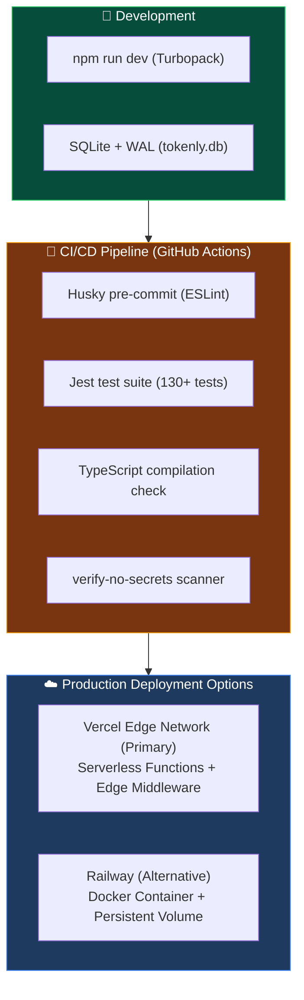

---

## 🏗️ 12. WEB3 & ON-CHAIN BLUEPRINT (PHASE 3/4 PLANNED)

While currently using local ethers.js abstraction, the finalized on-chain architecture will follow this blueprint:

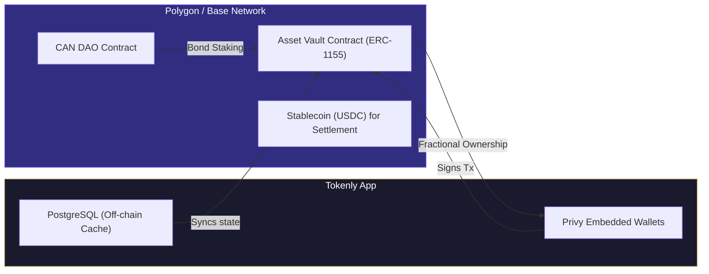

---

## 💡 13. RECOMMENDED ENHANCEMENTS & NEW FEATURES

> Priority enhancements designed to integrate seamlessly into the existing 5.0 architecture.

### 🔴 Priority 1 — Critical Production Gaps
1. **On-Chain Integration:** Deploy ERC-1155 smart contracts on Polygon/Base for real token minting and settlement.
2. **Physical Logistics API:** Integrate FedEx/DHL/eShipper APIs for automatic label generation and tracking.
3. **BIM Cloud Storage:** Replace `/tmp` with S3/R2 persistent storage for BIM models.
4. **Real-Time WebSocket Layer:** Replace interval polling with Socket.IO/Pusher for live trade feeds and tickers.

### 🟡 Priority 2 — High-Impact Features
5. **Mobile App (React Native):** Native mobile experience sharing the existing `lib/` logic.
6. **Social Trading:** Allow users to follow top traders and enable copy-trade functionality.
7. **NFT Certificates:** Issue Soulbound tokens as immutable proof of CAN authentication.
8. **Multi-Language (i18n):** `next-intl` setup for EN/SI/TA + dynamic locale detection.

### 🟢 Priority 3 — Growth & Polish
9. **Marketplace Chat:** End-to-end encrypted buyer-seller messaging with dispute resolution.
10. **Gamification 2.0:** Achievements, badges, daily streaks, and seasonal leaderboards.
11. **Theme Toggle:** Dark/light mode with system preference detection.
12. **Advanced Search:** Elasticsearch/Algolia integration with faceted filters.
13. **DAO Governance UI:** Frontend implementation for the existing `proposals` database tables.

---

## 🔑 14. ENVIRONMENT VARIABLE MAP

| Variable | Required | Layer | Purpose |
|---|:---:|---|---|
| `ENCRYPTION_KEY` | **YES** | Security | AES-256 wallet key encryption — hard fail if missing |
| `DATABASE_URL` | Prod | Data | PostgreSQL connection (omit for SQLite dev) |
| `NEXT_PUBLIC_PRIVY_APP_ID` | YES | Auth | Privy Web3 login ID |
| `PRIVY_APP_SECRET` | YES | Auth | Privy server verification |
| `ANTHROPIC_API_KEY` | YES | AI | Claude AI (advisor, prediction, compliance) |
| `RESEND_API_KEY` | Email | Comms | Resend email service |
| `NEXT_PUBLIC_STRIPE_PUBLISHABLE_KEY` | Pay | Pay | Stripe client key |
| `STRIPE_SECRET_KEY` | Pay | Pay | Stripe server key |
| `NEXT_PUBLIC_VAPID_PUBLIC_KEY` | Push | Comms | Web Push VAPID public |
| `VAPID_PRIVATE_KEY` | Push | Comms | Web Push VAPID private |
| `NEXT_PUBLIC_APP_URL` | YES | Config | App base URL |
| `BIM_MODEL_DIR` | Archion | Storage | BIM model directory |
| `ENABLE_DEV_BYPASS` | Dev | Auth | **NEVER in production** |

---

## 📈 15. PROJECT METRICS SUMMARY

| Metric | Value |
|---|---|
| **Total Source Files** | 130+ |
| **Lines of Code (src/)** | ~15,000+ |
| **API Route Groups** | 35 |
| **Database Tables** | 28 |
| **React Components** | 40+ |
| **Pages** | 25+ |
| **Core Engine Modules** | 10 |
| **Test Suites** | 12 (130+ test cases) |

---

> [!TIP]
> **How to Use This Chart**: This whiteboard is designed to be your single source of truth. When planning a new feature, check the Architecture diagram to understand where it fits, the Database section for schema needs, the Security section for compliance requirements, and the Enhancement section to see if it's already recommended. Every new feature should connect to at least 2-3 existing systems on this chart.

---
*Generated from complete analysis of 130+ source files in the Tokenly Protocol v5.0 codebase*
*Chart version: 2.0 (Enhanced) | Last updated: June 5, 2026*
